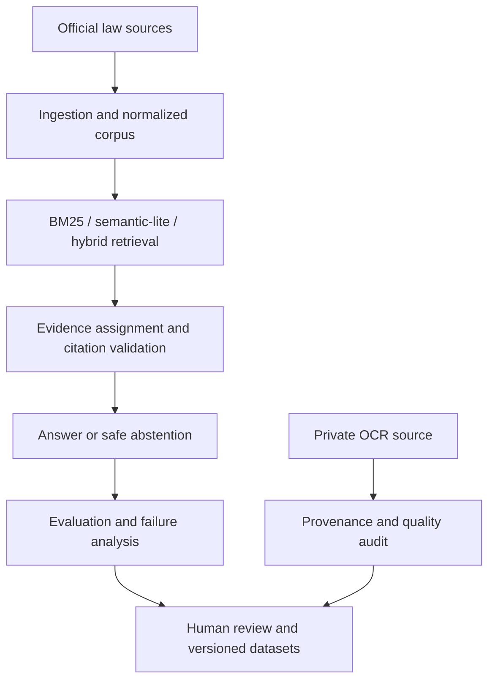

# Project Checkpoint: v4.27.6

## Purpose

This checkpoint records the implemented and verified state of the project at
v4.27.6. The project treats legal AI quality as a chain of concerns: corpus
structure, retrieval, evidence assignment, citation validation, safe
abstention, human review, provenance, and regression evaluation.

It does not treat a retrieved document, a generated answer, and a legal
conclusion as interchangeable claims.

## Implemented scope

### Public legal RAG pipeline

- Official-law ingestion preserves provision structure and effective-date
  metadata.
- BM25, character n-gram `semantic_lite`, and hybrid retrieval are available
  under a common benchmark interface.
- Semantic evidence assignment and citation validation connect answer claims
  to retrieved legal grounds.
- The workflow records execution trace, retrieval strategy, warnings,
  abstention reasons, and at most one bounded retry.
- Evaluation separates retrieval, grounding/citation, and safety/abstention
  outcomes; failures are recorded instead of being hidden by a single score.

### Reviewable data improvement path

- `wrong_top1`, `retrieval_miss`, and `over_retrieval` results can create
  hard-negative candidates.
- Candidates require human review before versioned training-data export.
- Dataset, corpus, split, and review metadata are checksummed to retain
  provenance and prevent train/validation leakage.

### Legal Reasoning foundation

The implemented `LegalReasoningSchema` represents claim, cause of action,
element, defense, counter-defense, burden, required fact, evidence type,
follow-up question, legal basis, and provenance as separate nodes and
relations. It validates internal references and supports deterministic JSON
round-trip.

This is a schema and integrity foundation, not an end-to-end legal conclusion
engine. Automated extraction, fact-to-element matching, defense analysis, and
end-to-end Legal Reasoning evaluation are outside the implemented scope.

### Private OCR provenance and quality gate

The OCR import tooling keeps copyrighted source text and private source
references outside the Git worktree. Public fixtures are authored minimal
examples only.

For one separately held private source, the v4.27.6 final audit recorded:

| Check | Result |
| --- | --- |
| Physical pages | 1,371 |
| Final segments | 9,793 |
| Approved text-correction overlays | 2 |
| Applied printed-page decisions | 124 |
| Missing printed-page labels | 0 |
| Review queue | 0 |
| Quality gate | `passed` |

The public repository contains neither the source text nor page snippets,
private review queues, correction text, source paths, or derived knowledge
base.

## Current architecture



The private OCR path is an audit and provenance boundary. It does not expose
source text to the public corpus or automatically approve legal knowledge.

## Verified evaluation results

Metrics below remain tied to their own dataset, code version, and execution
conditions. They are not interchangeable measures of a general legal-answer
accuracy.

### Retrieval comparison: v4.18.0

Source: [`docs/RETRIEVAL_BENCHMARK.md`](docs/RETRIEVAL_BENCHMARK.md). The benchmark uses
the 45 gold-bearing, non-abstention cases selected from official dataset
v2.0.0, Top-K 5, query rewrite on, and a local execution environment.

| Method | Top-1 | Hit@5 | Recall@5 | MRR | nDCG@5 |
| --- | ---: | ---: | ---: | ---: | ---: |
| BM25 | 37.78% | 66.67% | 66.67% | 0.4689 | 0.5172 |
| semantic-lite | 46.67% | 73.33% | 73.33% | 0.5748 | 0.6148 |
| hybrid | 46.67% | 75.56% | 75.56% | 0.5730 | 0.6184 |

`semantic_lite` is a dependency-free character n-gram baseline, not a dense
embedding model. Latency is environment-sensitive and is documented separately
from quality metrics.

### Workflow safety comparison: v4.16.0

Source: [`evaluation/baselines/v4.16.0_baseline_vs_agent_summary.json`](evaluation/baselines/v4.16.0_baseline_vs_agent_summary.json).
This is a 61-case closed deterministic evaluation with hybrid retrieval,
query rewrite, ontology reranking, and at most one retry.

| Metric | Baseline | Agent workflow |
| --- | ---: | ---: |
| Overall pass rate | 59.02% | 68.85% |
| Top-1 accuracy | 44.44% | 44.44% |
| Hit@K | 71.11% | 71.11% |
| MRR | 0.5348 | 0.5348 |
| Expected-abstention accuracy | 56.25% | 93.75% |
| Outcome accuracy | 75.41% | 83.61% |
| False-abstention rate | 17.78% | 20.00% |

The observed improvement came from safer handling of time ambiguity,
unsupported scope, and false premises, not from a retrieval-ranking gain. The
same run recorded 12 retries and a retry quality-improvement rate of 0%; retry
therefore is not presented as a performance gain.

### Current ML status

The approved civil hard-negative dataset and deterministic train/validation
split are prepared. Pretrained embedding benchmarks, reranker experiments,
fine-tuning, and checkpoint evaluation have not been executed in this
checkpoint; no unexecuted-model metrics are claimed.

## Verification and reproducibility

The v4.27.6 local regression run used:

```bash
LAW_RAG_LLM_PROVIDER=deterministic python -m pytest -q
```

Result: `324 passed, 1 warning in 174.25s`. The remaining warning is a
Starlette TestClient/httpx deprecation warning and did not fail a test.

Useful public checks include:

```bash
python tools/validate_evaluation_dataset.py

python -m tools.run_retrieval_benchmark \
  --methods bm25 semantic_lite hybrid \
  --top-k 5 \
  --fail-under-hit-at-k 0.60 \
  --fail-under-mrr 0.45
```

OCR provenance and decision artifacts must remain outside the repository and
are intentionally not part of the public reproduction path.

## Current limits and next work

| Area | Current state |
| --- | --- |
| Legal RAG retrieval, grounding, citation checks, evaluation | Implemented and evaluable |
| Legal Reasoning Schema and integrity validation | Implemented |
| End-to-end Legal Reasoning MVP | Not implemented |
| GPU retrieval enhancement | Data prepared; execution deferred |
| Private OCR source audit | Completed in private storage; source not published |

Planned work, not current capability:

1. Manual legal knowledge curation
2. Source extraction and review/approval
3. Fact-to-element matching
4. Defense and follow-up-question handling
5. Evidence integration and Legal Reasoning evaluation
6. End-to-end MVP, then retrieval-model experiments and civil-claim expansion

## Related documentation

- [`README.md`](README.md): system overview and public entry points
- [`LEGAL_REASONING_SCHEMA.md`](docs/LEGAL_REASONING_SCHEMA.md): schema boundary
- [`OCR_PROVENANCE_AUDIT.md`](docs/OCR_PROVENANCE_AUDIT.md): private OCR policy
- [`PRINTED_PAGE_DECISIONS.md`](docs/PRINTED_PAGE_DECISIONS.md): approved page-label policy
- [`EVALUATION_REPORT.md`](docs/EVALUATION_REPORT.md): workflow evaluation details
- [`HARD_NEGATIVE_PIPELINE.md`](docs/HARD_NEGATIVE_PIPELINE.md): review-gated data path
