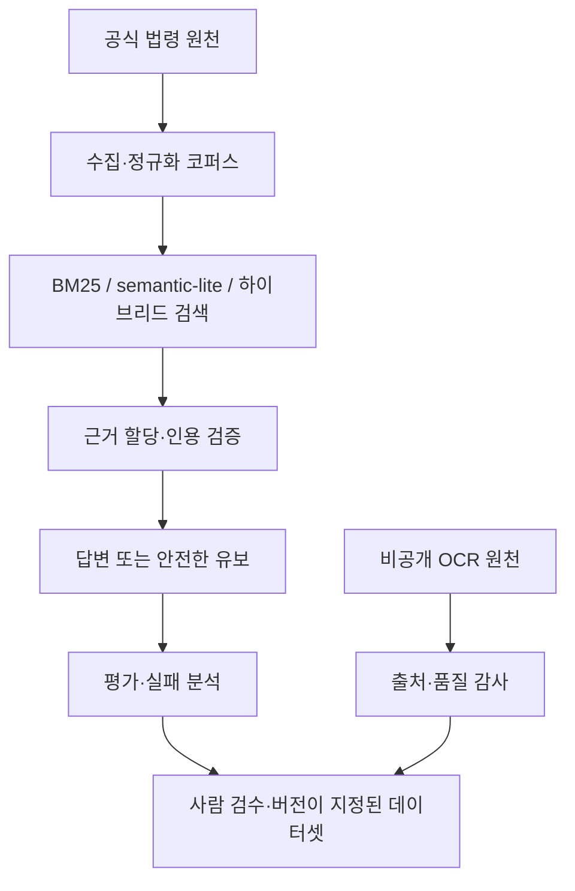

# 프로젝트 체크포인트: v4.27.6

## 목적

이 문서는 v4.27.6에서 구현하고 검증한 프로젝트 상태를 기록합니다. 이 프로젝트는
법률 AI 품질을 코퍼스 구조, 검색, 근거 할당, 인용 검증, 안전한 답변 유보,
사람 검수, 출처 추적과 회귀평가가 이어지는 하나의 과정으로 다룹니다.

검색된 문서, 생성된 답변과 법적 결론을 서로 같은 것으로 간주하지 않습니다.

## 구현 범위

### 공개 법률 RAG 파이프라인

- 공식 법령 수집 과정에서 조문 구조와 시행일 메타데이터를 보존합니다.
- BM25, 문자 n-gram `semantic_lite`와 하이브리드 검색을 공통 벤치마크
  인터페이스로 제공합니다.
- 의미 기반 근거 할당과 인용 검증으로 답변의 주장과 검색된 법적 근거를 연결합니다.
- 워크플로는 실행 추적, 검색 전략, 경고, 답변 유보 사유와 최대 1회의 제한된
  재시도를 기록합니다.
- 평가 결과를 검색, 근거·인용과 안전성·답변 유보로 나누며, 실패를 하나의 점수
  뒤에 숨기지 않고 기록합니다.

### 검수 가능한 데이터 개선 경로

- `wrong_top1`, `retrieval_miss`, `over_retrieval` 결과로 hard-negative 후보를
  만들 수 있습니다.
- 후보는 버전이 지정된 학습 데이터로 내보내기 전에 사람의 검수를 통과해야 합니다.
- 데이터셋, 코퍼스, 분할과 검수 메타데이터의 체크섬을 기록하여 출처를 추적하고
  학습·검증 데이터 누수를 방지합니다.

### 법률 추론 기반

구현된 `LegalReasoningSchema`는 청구권, 청구원인, 요건, 항변, 재항변,
주장·증명책임, 필요 사실, 증거 유형, 후속 질문, 법적 근거와 출처를 각각의 노드와
관계로 표현합니다. 내부 참조를 검증하며 결정론적인 JSON 왕복 변환을 지원합니다.

이는 스키마와 무결성 기반이지, 법적 결론을 처음부터 끝까지 자동 생성하는 엔진은
아닙니다. 자동 추출, 사실→요건 매칭, 항변 분석과 전체 Legal Reasoning 평가는
현재 구현 범위에 포함되지 않습니다.

### 비공개 OCR 출처 추적과 품질 게이트

OCR 가져오기 도구는 저작권이 있는 원문과 비공개 출처 참조를 Git 작업 트리 밖에
보관합니다. 공개 fixture는 최소한의 예시를 직접 작성한 것뿐입니다.

별도로 보관한 비공개 원천 1건에 대한 v4.27.6 최종 감사 결과는 다음과 같습니다.

| 검사 항목 | 결과 |
| --- | ---: |
| 물리 페이지 | 1,371 |
| 최종 세그먼트 | 9,793 |
| 승인된 텍스트 교정 오버레이 | 2 |
| 반영된 인쇄면수 결정 | 124 |
| 누락된 인쇄면수 표지 | 0 |
| 검수 대기열 | 0 |
| 품질 게이트 | `passed` |

공개 저장소에는 원문, 페이지 일부, 비공개 검수 대기열, 교정문, 원천 경로나 파생
지식베이스를 포함하지 않습니다.

## 현재 아키텍처



비공개 OCR 경로는 감사와 출처 추적을 위한 경계입니다. 원문을 공개 코퍼스에
노출하거나 법률지식으로 자동 승인하지 않습니다.

## 검증된 평가 결과

아래 지표는 각 데이터셋, 코드 버전과 실행 조건에 연결되어 있습니다. 서로 바꾸어
쓸 수 있는 일반적인 법률 답변 정확도 지표가 아닙니다.

### 검색 비교: v4.18.0

출처: [`docs/RETRIEVAL_BENCHMARK.md`](docs/RETRIEVAL_BENCHMARK.md). 공식 데이터셋
v2.0.0에서 정답 근거가 있고 답변 유보 대상이 아닌 45개 사례를 Top-K 5,
질의 재작성 사용, 로컬 실행 환경에서 평가했습니다.

| 검색 방법 | Top-1 | Hit@5 | Recall@5 | MRR | nDCG@5 |
| --- | ---: | ---: | ---: | ---: | ---: |
| BM25 | 37.78% | 66.67% | 66.67% | 0.4689 | 0.5172 |
| semantic-lite | 46.67% | 73.33% | 73.33% | 0.5748 | 0.6148 |
| hybrid | 46.67% | 75.56% | 75.56% | 0.5730 | 0.6184 |

`semantic_lite`는 dense embedding 모델이 아니라 의존성 없는 문자 n-gram
기준선입니다. 실행 환경에 민감한 지연시간은 품질 지표와 분리해 기록합니다.

### 워크플로 안전성 비교: v4.16.0

출처: [`evaluation/baselines/v4.16.0_baseline_vs_agent_summary.json`](evaluation/baselines/v4.16.0_baseline_vs_agent_summary.json).
하이브리드 검색, 질의 재작성, ontology reranking과 최대 1회 재시도를 적용한
61개 사례의 폐쇄형·결정론적 평가입니다.

| 지표 | 기준선 | Agent 워크플로 |
| --- | ---: | ---: |
| 전체 통과율 | 59.02% | 68.85% |
| Top-1 정확도 | 44.44% | 44.44% |
| Hit@K | 71.11% | 71.11% |
| 답변 유보 대상 정확도 | 56.25% | 93.75% |
| 결과 정확도 | 75.41% | 83.61% |
| 불필요한 답변 유보율 | 17.78% | 20.00% |

관측된 개선은 검색 순위 향상이 아니라 시점 불명, 지원 범위 밖 질문과 거짓 전제를
더 안전하게 처리한 결과입니다. 같은 실행에서 재시도는 12건, 재시도로 품질이
개선된 비율은 0%였으므로 재시도를 성능 향상으로 제시하지 않습니다.

### 현재 ML 상태

승인된 민법 hard-negative 데이터셋과 결정론적 학습·검증 분할을 준비했습니다.
이 체크포인트에서는 사전 학습 embedding 벤치마크, reranker 실험, fine-tuning과
체크포인트 평가를 실행하지 않았으며, 미실행 모델의 성능 수치를 주장하지 않습니다.

## 검증과 재현

v4.27.6 로컬 회귀 테스트는 다음 명령으로 실행했습니다.

```bash
LAW_RAG_LLM_PROVIDER=deterministic python -m pytest -q
```

결과는 `324 passed, 1 warning in 174.25s`입니다. 남은 경고 1건은 Starlette
TestClient/httpx의 deprecation warning이며 테스트 실패가 아닙니다.

공개 환경에서 실행할 수 있는 주요 검증 명령은 다음과 같습니다.

```bash
python tools/validate_evaluation_dataset.py

python -m tools.run_retrieval_benchmark \
  --methods bm25 semantic_lite hybrid \
  --top-k 5 \
  --fail-under-hit-at-k 0.60 \
  --fail-under-mrr 0.45
```

OCR 출처와 결정 산출물은 저장소 밖에 보관해야 하며, 의도적으로 공개 재현 경로에
포함하지 않습니다.

## 현재 한계와 다음 작업

| 영역 | 현재 상태 |
| --- | --- |
| 법률 RAG 검색·근거 연결·인용 검증·평가 | 구현 및 평가 가능 |
| 법률 추론 스키마·무결성 검증 | 구현 |
| E2E 법률 추론 MVP | 미구현 |
| GPU 검색 고도화 | 데이터 준비, 실행 보류 |
| 비공개 OCR 원천 감사 | 비공개 저장소에서 완료, 원문 미공개 |

현재 기능이 아니라 계획된 작업은 다음과 같습니다.

1. 수동 법률지식 정제
2. 원천 추출과 검수·승인
3. 사실→요건 매칭
4. 항변과 후속 질문 처리
5. 증거 통합과 법률 추론 평가
6. E2E MVP 완성 후 검색 모델 실험과 민사 청구 확장

## 관련 문서

- [`README.md`](README.md): 시스템 개요와 공개 진입점
- [`LEGAL_REASONING_SCHEMA.md`](docs/LEGAL_REASONING_SCHEMA.md): 스키마 경계
- [`OCR_PROVENANCE_AUDIT.md`](docs/OCR_PROVENANCE_AUDIT.md): 비공개 OCR 정책
- [`PRINTED_PAGE_DECISIONS.md`](docs/PRINTED_PAGE_DECISIONS.md): 승인된 페이지 표지 정책
- [`EVALUATION_REPORT.md`](docs/EVALUATION_REPORT.md): 워크플로 평가 상세
- [`HARD_NEGATIVE_PIPELINE.md`](docs/HARD_NEGATIVE_PIPELINE.md): 검수 기반 데이터 경로
