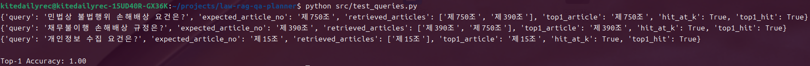
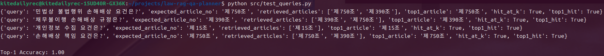
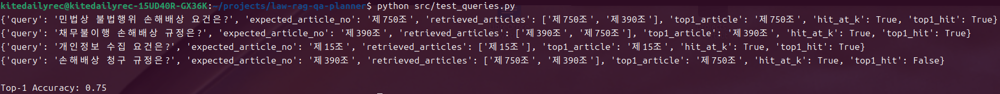
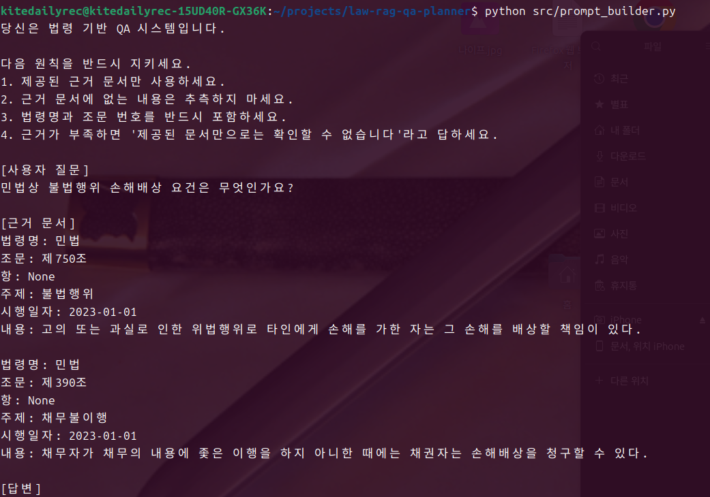

# 법령 문서 기반 RAG QA 시스템 데이터 기획 및 미니 구현

# Law RAG QA Planner

> v4.0.0 adds a Legal Logic Engine: Evidence/Reasoning → Legal Logic Tree → Logic Validation → Answer Skeleton → Sentence Planner.

Current service version: **v3.5.0** — Reasoning Tree → Answer Planner → deterministic answer serialization.

법령 문서 기반 RAG QA 시스템을 설계하고,
retrieval 성능과 failure case를 분석한 프로젝트입니다.

## What I Did

- 법령 QA에서 발생하는 hallucination 문제를 정의
- 법령 구조를 반영한 metadata schema 설계
- 조문 단위 chunking 전략 설계 및 구현
- keyword 기반 retrieval 시스템 구현
- retrieval accuracy 평가 로직 설계 (Hit@K, Top-1)
- failure case를 직접 설계하고 원인 분석
- RAG 시스템 개선 방향 제시 (semantic search, reranking)

본 프로젝트는 단순 구현이 아니라  
**법령 도메인 특성을 반영한 RAG 시스템 설계 및 검증 경험**을 보여주기 위해 수행하였다.

## 1. 프로젝트 개요

본 프로젝트는 법령 문서를 기반으로 한 RAG(Retrieval-Augmented Generation) QA 시스템의 데이터 구조, 검색 전략, 프롬프트 설계, 평가 지표를 설계하고 간단히 구현한 미니 프로젝트입니다.

법령 영역에서는 LLM이 단독으로 답변할 경우 환각, 출처 불명확, 최신 개정 반영 오류가 발생할 수 있습니다. 따라서 법령 데이터를 조문 단위로 구조화하고, metadata 기반 필터링과 검색 전략을 결합하여 근거 기반 답변을 생성하는 구조가 필요합니다.

## 2. 문제 정의

법령 QA 시스템에서 중요한 문제는 다음과 같습니다.

- 정확한 조문 검색
- 개정일 및 시행일 반영
- 근거 없는 답변 생성 방지
- 출처와 조문 번호 명시
- 검색 실패 및 환각 케이스 관리

## 3. 데이터 구조 설계

각 법령 데이터는 다음과 같은 metadata를 포함합니다.

- document_type
- law_name
- article_no
- clause_no
- item_no
- effective_date
- revision_date
- authority
- reliability
- topic
- keywords
- content

## 4. Chunking 전략

일반 문서처럼 길이 기준으로 chunking하지 않고, 법령의 의미 구조에 맞춰 조문 단위 chunking을 사용합니다.

기본 단위는 조문(article)이며, 필요한 경우 항(clause), 호(item) 단위로 세분화할 수 있습니다.

## 5. Retrieval 전략

본 미니 구현에서는 간단한 keyword 기반 검색을 사용했지만, 실제 서비스에서는 다음 구조로 확장할 수 있습니다.

1. 사용자 질문 분석
2. 법령명, 주제, 조문번호 기반 metadata filtering
3. semantic vector search
4. keyword search
5. reranking
6. 근거 문서 선택
7. LLM 답변 생성

## 6. Prompt 설계

LLM 답변 생성 단계에서는 다음 원칙을 적용합니다.

- 제공된 근거 문서만 사용
- 근거에 없는 내용은 추측 금지
- 법령명과 조문 번호 명시
- 근거 부족 시 fallback 응답

## 7. Evaluation 설계

단순 정답률이 아니라 다음 지표를 함께 평가해야 합니다.

- retrieval accuracy
- answer grounding
- hallucination rate
- source completeness
- freshness

### Why Top-1 Accuracy?

본 프로젝트에서는 retrieval 성능 평가 시 Hit@K뿐 아니라 Top-1 Accuracy를 함께 고려하였다.

법령 QA의 특성상 단순히 정답 조문이 검색 결과에 "포함"되는 것만으로는 충분하지 않다.

- 실제 QA 시스템은 하나의 조문을 근거로 답변을 생성함
- 따라서 Top-K에 포함되더라도 Top-1이 잘못되면 잘못된 답변으로 이어질 가능성이 높음

예를 들어:

Query: "손해배상 청구 규정은?"

- Top-K 결과: [제750조, 제390조] → Hit@K 기준 성공
- Top-1 결과: 제750조 → 실제로는 제390조가 더 적절

이 경우 Hit@K는 높게 나오지만, 실제 서비스 품질은 낮다.

따라서 본 프로젝트에서는 **실제 QA 품질을 반영하기 위해 Top-1 Accuracy를 주요 지표로 사용하였다.**

## 8. 실행 방법

```bash
python src/chunking.py
python src/retriever.py
python src/prompt_builder.py
python src/evaluation.py
```

## 9. Evaluation 결과

샘플 데이터 기반 테스트 결과:

- Top-1 Accuracy: 1.00 (3/3)

※ 단, 본 결과는 제한된 샘플 데이터 기준이며, 실제 서비스에서는 더 다양한 질의와 대규모 데이터셋 기반 평가가 필요할 것으로 보임.


## 10. Failure Case Analysis

본 프로젝트에서는 단순히 정답을 맞추는 것이 아니라, retrieval 단계에서 발생할 수 있는 failure case를 재현하고 그 원인과 개선 방향을 분석하였다.

---

### Failure Case 1: 법령명 누락 (Missing Law Name)

**Query**

손해배상 책임 요건은 무엇인가?

I. 실험결과

해당 질의에 대한 retrieval 결과:

-Top results: 제750조, 제390조
-Hit@K 기준에서는 정답 포함 (Hit)
-그러나 복수의 후보 조문이 함께 검색됨


II. 문제 원인

질의에 법령명(민법)이 명시되지 않음
"손해배상" 키워드는 불법행위(제750조)와 채무불이행(제390조) 모두에서 사용됨
keyword 기반 retrieval만으로는 법적 맥락(disambiguation)을 구분하기 어려움

III. 의미

Hit@K 기준에서는 성능이 높게 측정될 수 있으나,
실제 서비스에서는 Top-1 정확도 저하 및 잘못된 조문 선택 가능성 존재

IV. 개선방향

query intent 분석을 통한 법령명 및 주제 추론
semantic search 도입 (embedding 기반 의미 유사도 활용)
query expansion 적용
(예: "손해배상" → "불법행위 손해배상")
reranking 단계에서 법적 맥락 반영

### Failure Case 2: 유사 키워드 충돌

Query:
손해배상 청구 규정은?

Expected:
민법 제390조



I. 실험 결과

keyword 기반 retrieval에서는 "손해배상" 키워드가 포함된 민법 제750조가 Top-1으로 선택되었다.

II. 문제 원인

민법 제750조와 제390조는 모두 "손해배상"과 관련되지만,
제750조는 불법행위 책임, 제390조는 채무불이행 책임에 관한 조문이다.
단순 keyword matching은 "청구"라는 법적 맥락을 충분히 반영하지 못한다.

III. 의미

Hit@K 기준에서는 정답 조문이 포함될 수 있지만,
Top-1 기준에서는 잘못된 조문이 선택될 수 있다.


## 11. 간단실행 결과



## 12. Retrieval Evaluation (Sample)

본 프로젝트에서는 retrieval accuracy를 평가하기 위해 테스트 쿼리셋을 구성하고,
expected article 기준으로 hit 여부를 측정하는 구조를 설계했습니다.

### Sample Test Cases

| Query | Expected Article | Hit 여부 |
|------|----------------|----------|
| 민법상 불법행위 손해배상 요건은? | 제750조 | Hit |
| 채무불이행 손해배상 규정은? | 제390조 | Hit |
| 개인정보 수집 요건은? | 제15조 | Hit |
| 손해배상 청구 규정은? | 제390조 | Top-1 Fail / Hit@K |


※ 본 결과는 샘플 데이터 기반 테스트이며,
실제 서비스에서는 더 큰 데이터셋과 다양한 질의에 대한 평가가 필요합니다.

## What I Learned

본 프로젝트를 통해 단순히 RAG를 구현하는 것보다,
retrieval failure를 분석하고 이를 개선하는 구조를 설계하는 것이
실제 서비스 품질에 더 중요하다는 것을 확인했다.

특히 법령 QA에서는
- 단순 keyword matching의 한계
- Top-1 정확도의 중요성
- failure case 기반 개선 필요성

을 실험적으로 검증하였다.

---

# v0.2 — 도메인 확장형 법령 RAG 코어

기존 미니 구현을 유지하면서, 신규 법률 도메인을 코드 재개발 없이 온보딩할 수 있도록 구조를 확장했다.

## 이번 패치의 핵심

- `LegalProvision` 공통 스키마 도입
- 기존 JSON 형식과 신규 정규화 형식 모두 지원
- BM25 + 문자 n-gram 유사도 기반 Hybrid Retrieval
- 도메인별 법령 목록·동의어·검색 가중치 설정 분리
- 기준일(`as_of_date`)에 따른 시행 법령 필터 기반 마련
- 근거 없는 답변을 막기 위한 abstention 구조
- 생성 답변의 미검색 조문 인용을 탐지하는 citation validator
- 도메인 독립적인 검색 서비스와 CLI
- 노동법 도메인 팩을 통해 향후 확장 방식 예시 제공

## 구조

```text
law_rag/
├── domain/       # 공통 법령 스키마와 도메인 설정
├── ingestion/    # 데이터 소스 adapter 및 정규화
├── retrieval/    # BM25, semantic-lite, hybrid retrieval
├── generation/   # grounded prompt 및 citation validation
└── evaluation/   # Top-1, Hit@K, MRR 평가

domains/
├── civil_transactions/
├── digital_business/
├── electronic_finance/
└── labor/
```

## 실행

기존 명령은 그대로 사용할 수 있다.

```bash
python src/chunking.py
python src/retriever.py
python src/evaluation.py
```

신규 CLI:

```bash
python -m law_rag "개인정보 수집 동의 요건은?" --domain digital_business
python -m law_rag "손해배상 청구 규정은?" --domain civil_transactions --top-k 3
```

등록된 법령 데이터가 없는 도메인은 다른 분야의 조문을 억지로 반환하지 않고 빈 결과와 `abstain=true`를 반환한다.

## 신규 도메인 추가 방법

1. `domains/<domain_id>/domain.json` 생성
2. 법령명, 동의어, 검색 가중치 등록
3. 해당 법령을 공통 `LegalProvision` 스키마로 적재
4. 도메인별 benchmark 작성
5. 동일 retrieval/service 코드를 그대로 사용

전자금융·노동·조세·의료·지식재산 등으로 확장할 때 검색 엔진 코드를 수정하지 않고 데이터와 설정, 평가셋만 추가하는 것을 목표로 한다.

> 현재 포함된 법령 데이터는 구조 검증용 소규모 샘플이며 실제 법률자문이나 현행 법령 확인 용도가 아니다.


## v0.3 evidence expansion

기본 데이터는 `data/legal_corpus.json`입니다. 직접 검색된 조문의 `related_article_ids`를 따라 고지사항, 최소수집 원칙, 동의 방식 등 보조 근거를 함께 반환합니다. 현재 추가된 신규 규제 조문은 국가법령정보센터를 확인한 **공식 조문 요약(`content_kind=official_summary`)**이며, 원문 그대로가 필요한 운영 환경에서는 공식 API/원문 적재기로 교체해야 합니다.

## 공식 법령 XML 수집 (v0.4)

로컬 XML로 먼저 파서를 검증할 수 있습니다.

```bash
python3 -m law_rag.ingestion \
  --xml tests/fixtures/sample_law.xml \
  --domain digital_business \
  --output data/imported_corpus.json
```

실제 API 응답을 수집할 때는 계정·엔드포인트를 코드에 저장하지 않습니다.

```bash
export LAW_API_BASE_URL='공식 API 엔드포인트'
export LAW_API_OC='발급받은 호출자 식별값'
python3 -m law_rag.ingestion \
  --law-id '법령ID' \
  --domain digital_business \
  --output data/legal_corpus.json
```

수집기는 임시 파일에 먼저 기록한 후 교체하므로 실패한 요청이 기존 코퍼스를 훼손하지 않습니다. 원문은 `content_kind=official_text`, 법령 일련번호는 `version_id`, 시행일은 `effective_from`으로 저장됩니다.

---

# v0.5 — 국가법령정보 공동활용 API 실제 규격 연결

v0.4의 범용 XML 수집기 골격을 법제처 국가법령정보 공동활용 API의 실제 요청 규격에 맞게 구체화했다.

## 핵심 변경사항

- 법령 목록 검색과 본문 조회를 별도 endpoint로 분리
  - 목록 검색: `lawSearch.do?target=law`
  - 시행일 기준 본문: `lawService.do?target=eflaw`
- 정확한 법령명으로 법령 ID를 자동 확인하는 `--law-name` 추가
- 법령 ID를 알고 있을 때 바로 수집하는 `--law-id` 유지
- API 인증값 `OC`가 `source_url`이나 오류 메시지에 저장되지 않도록 제거
- 유사한 법령명만 검색되면 자동 선택하지 않고 중단
- 조문 가지번호를 `제15조의2` 형식으로 정규화
- 법령 구조를 조·항·호·목 단위까지 파싱
- 조문별 시행일자가 있으면 법령 전체 시행일자보다 우선 적용
- 병합 전에 결과만 확인하는 `--preview` 모드 추가
- HTTP 오류, 연결 오류, 비 XML 응답 및 API 오류 응답을 명시적으로 처리

## API 인증정보 설정

국가법령정보 공동활용 서비스에서 발급받은 API 인증값을 환경변수로 설정한다.

```bash
export LAW_API_OC='발급받은_API_인증값'
```

기본 endpoint는 코드에 이미 설정되어 있으므로 일반적인 경우 별도 URL 설정은 필요하지 않다.

```text
https://www.law.go.kr/DRF/lawSearch.do
https://www.law.go.kr/DRF/lawService.do
```

## 개인정보 보호법 원문 미리보기

기존 코퍼스를 변경하기 전에 별도 파일로 확인한다.

```bash
python3 -m law_rag.ingestion \
  --law-name '개인정보 보호법' \
  --domain digital_business \
  --preview data/pipa_preview.json
```

출력 파일과 조문 수를 검토한 후 실제 코퍼스에 병합한다.

```bash
python3 -m law_rag.ingestion \
  --law-name '개인정보 보호법' \
  --domain digital_business \
  --output data/legal_corpus.json
```

법령 ID를 이미 알고 있는 경우:

```bash
python3 -m law_rag.ingestion \
  --law-id '011357' \
  --domain digital_business \
  --output data/legal_corpus.json
```

## 로컬 XML 회귀 테스트

```bash
python3 -m law_rag.ingestion \
  --xml tests/fixtures/official_law_body.xml \
  --domain digital_business \
  --preview data/local_preview.json
```

## 검증

```bash
pytest -q
```

v0.5 기준 자동 테스트는 다음 범위를 포함한다.

- 기존 JSON 호환성
- 도메인 필터 및 하이브리드 검색
- 관련 조문 확장과 재점수화
- 시행일 기준 미래 조문 제외
- XML 조·항·호·목 파싱
- 법령명 정확 일치 확인
- 목록 검색 후 본문 조회
- 인증값 비노출

## FastAPI 실행 (v0.6)

CLI와 HTTP API는 동일한 `LawRagService`를 사용합니다.

```bash
python3 -m pip install -r requirements.txt
python3 -m law_rag.api
```

기본 주소는 `http://127.0.0.1:8000`입니다.

- Swagger UI: `/docs`
- OpenAPI JSON: `/openapi.json`
- 상태 확인: `GET /health`
- 도메인 목록: `GET /domains`
- 적재 법령 목록: `GET /laws?domain=digital_business`
- 검색 전용: `POST /retrieve`
- 검색 + 생성 프롬프트: `POST /query`

질의 예시:

```bash
curl -X POST 'http://127.0.0.1:8000/query' \
  -H 'Content-Type: application/json' \
  -d '{
    "question": "개인정보 수집 동의 요건은?",
    "domain": "digital_business",
    "top_k": 1,
    "as_of_date": "2026-07-24"
  }'
```

환경변수로 실행 설정을 변경할 수 있습니다.

```bash
export LAW_RAG_DATA_PATH='data/legal_corpus.json'
export LAW_RAG_DOMAINS_PATH='domains'
export LAW_RAG_HOST='0.0.0.0'
export LAW_RAG_PORT='8000'
python3 -m law_rag.api
```

## v0.7 Answer Generation

v0.7 adds an LLM provider abstraction and a grounded answer endpoint. Retrieval,
prompt construction, generation, and citation validation remain separate layers.

### Offline validation

No API key is required for the deterministic local provider:

```bash
export LAW_RAG_LLM_PROVIDER=deterministic
python3 -m law_rag.api
```

Then call:

```bash
curl -X POST 'http://127.0.0.1:8000/answer' \
  -H 'Content-Type: application/json' \
  -d '{
    "question": "개인정보 수집 동의 요건은?",
    "domain": "digital_business",
    "top_k": 1
  }'
```

The response includes `answer`, `generation_status`, provider/model metadata, and
`citation_validation`. The deterministic provider exists only for pipeline and UI
validation; it is not a substitute for a production language model.

### Provider configuration

Generation is disabled by default. Configure an OpenAI-compatible endpoint with:

```bash
export LAW_RAG_LLM_PROVIDER=openai_compatible
export LAW_RAG_LLM_API_KEY='...'
export LAW_RAG_LLM_MODEL='gpt-4.1-mini'
export LAW_RAG_LLM_BASE_URL='https://api.openai.com/v1'
```

Provider failures do not destroy retrieval output. `/answer` returns a safe
`generation_status: failed` response while preserving the evidence results.

## v0.8 회귀 평가

기본 평가셋으로 검색 정확도, MRR, recall@k, abstention, 시행일 필터, 생성 답변의 인용 정확도를 한 번에 측정합니다.

```bash
export LAW_RAG_LLM_PROVIDER=deterministic
python3 -m law_rag.evaluation \
  --dataset evaluation/datasets/core_cases.json \
  --output evaluation/reports/latest.json
```

CI에서 최소 합격률을 강제하려면 다음 옵션을 사용합니다.

```bash
python3 -m law_rag.evaluation --fail-under 0.8
```

## v0.9 내부 검증용 Web UI

로컬 검증 provider를 사용해 서버를 실행합니다.

```bash
export LAW_RAG_LLM_PROVIDER=deterministic
python3 -m law_rag.api
```

브라우저에서 `http://127.0.0.1:8000/`을 열면 다음 기능을 사용할 수 있습니다.

- 검색만, Grounded Prompt 포함 검색, 답변 및 인용 검증 모드
- 도메인·검색 수·기준일 지정
- 검색 점수와 직접/관련 근거 비교
- 생성 상태와 인용 검증 결과 확인
- 기본 평가셋 실행 및 최근 리포트 조회
- 통과율, Top-1, Hit@K, Recall@K, MRR, abstention, 시행일, 인용 정확도 표시
- 실패 사례 필터링 및 예상/실제 문서 ID 비교

평가 API:

```text
GET  /evaluation/latest
POST /evaluation/run
```

## v1.0 운영 메타데이터

`POST /answer`는 기존 응답과 호환되면서 다음 필드를 추가로 반환합니다.

- `confidence`: 근거 점수, 수준, 산정 사유
- `metadata`: 서비스·코퍼스 버전, 생성 시각, 처리 시간
- `prompt_version`: 사용한 프롬프트 버전
- `results[].matched_signals`: lexical·semantic·relation 신호

프롬프트는 `prompts/system.md`, `prompts/answer_v1.md`에서 관리합니다.
답변 요청 로그는 기본적으로 `logs/YYYYMMDD.jsonl`에 기록됩니다.

## v1.1 Docker 실행

빌드 및 실행:

```bash
cp .env.example .env
docker compose up --build -d
```

상태 확인:

```bash
docker compose ps
curl http://127.0.0.1:8000/health
```

로그 확인과 종료:

```bash
docker compose logs -f law-rag-api
docker compose down
```

기본 Compose 설정은 로컬 파이프라인 검증을 위해 `deterministic` provider를 사용합니다.
실제 OpenAI 호환 provider를 사용할 때는 `.env`에 API 키와 provider 설정을 지정하고,
`.env` 파일은 저장소에 커밋하지 않습니다.

컨테이너는 비루트 `app` 사용자로 실행되며 `/health` 기반 Docker healthcheck를 포함합니다.
운영 로그와 평가 리포트는 각각 호스트의 `logs/`, `evaluation/reports/`에 보존됩니다.

## v1.1 GitHub Actions

`.github/workflows/ci.yml`은 다음 품질 게이트를 수행합니다.

1. Python 3.10 및 3.12 테스트
2. 기본 평가셋 회귀 평가(`--fail-under 0.8`)
3. Docker 이미지 빌드
4. 컨테이너 `/health` 확인
5. `/answer` smoke test

GitHub에 push하거나 pull request를 생성하면 자동 실행됩니다.

## v1.2 OpenAI 실연동

`openai` provider는 OpenAI Responses API를 사용합니다.

```bash
export LAW_RAG_LLM_PROVIDER=openai
export LAW_RAG_LLM_API_KEY='발급받은_API_KEY'
export LAW_RAG_LLM_MODEL=gpt-4.1-mini
export LAW_RAG_LLM_BASE_URL=https://api.openai.com/v1
export LAW_RAG_LLM_TIMEOUT=30
export LAW_RAG_LLM_MAX_RETRIES=2
python3 -m law_rag.api
```

실제 답변 요청:

```bash
curl -X POST 'http://127.0.0.1:8000/answer' \
  -H 'Content-Type: application/json' \
  -d '{
    "question": "개인정보 수집 동의 요건은?",
    "domain": "digital_business",
    "top_k": 1
  }'
```

응답에는 생성 provider와 model 외에 다음 필드가 포함됩니다.

- `generation_request_id`: provider 요청 추적 ID
- `generation_usage.input_tokens`
- `generation_usage.output_tokens`
- `generation_usage.total_tokens`

429, 5xx, 연결 오류, 시간 초과는 `LAW_RAG_LLM_MAX_RETRIES` 범위에서 지수형 대기 후 재시도합니다.
API 키는 로그와 응답에 기록하지 않으며 `.env`는 저장소에 커밋하지 않습니다.

OpenAI-compatible 로컬 또는 외부 서버는 Chat Completions 경로를 사용합니다.

```bash
export LAW_RAG_LLM_PROVIDER=openai_compatible
export LAW_RAG_LLM_API_KEY='서버가_요구하는_키'
export LAW_RAG_LLM_MODEL='서버_모델명'
export LAW_RAG_LLM_BASE_URL='http://127.0.0.1:1234/v1'
```

API 키가 없거나 provider 설정이 잘못되어도 검색 결과는 유지되고,
`generation_status="failed"`와 안전한 오류 메시지가 반환됩니다.

## `.env` automatic loading

The application automatically loads the nearest project `.env` file through `python-dotenv`. Existing shell or deployment environment variables are never overwritten (`override=False`). The effective priority is:

```text
OS / container environment > .env > code defaults
```

Create a local file from the safe template:

```bash
cp .env.example .env
python3 -m law_rag.api
```

To use a different file, set `LAW_RAG_ENV_FILE=/absolute/path/to/.env`. Never commit `.env` or API keys.

## Official corpus synchronization (v1.4)

Create a manifest from `data/official_laws.example.json`, configure `LAW_API_OC` in `.env`, and run:

```bash
python -m law_rag.ingestion \
  --manifest data/official_laws.example.json \
  --output data/legal_corpus.json
```

Each successful law response is normalized and cached under `data/official_cache/`. Cached data is not used silently. To continue local development during an API outage, opt in explicitly:

```bash
python -m law_rag.ingestion \
  --manifest data/official_laws.example.json \
  --output data/legal_corpus.json \
  --allow-cache-fallback
```

The synchronization report distinguishes `fetched` and `cached` laws. `LAW_API_OC` is removed from persisted provenance URLs and corpus files.

### v1.4.1 official XML compatibility

The search parser accepts the production `<law>` element and Korean response fields (`법령명한글`, `법령ID`, `법령일련번호`, `현행연혁코드`, `시행일자`, `법령상세링크`). Name-based synchronization resolves the exact normalized law name and requests the body with `MST=<법령일련번호>`. Search metadata is validated and `OC` is redacted from persisted URLs and error diagnostics.

```bash
unset LAW_API_OC  # only when an empty shell variable is shadowing .env
python3 -m law_rag.ingestion \
  --manifest data/official_laws.example.json \
  --output data/legal_corpus.json

python3 -m pytest -q
LAW_RAG_LLM_PROVIDER=deterministic python3 -m law_rag.evaluation \
  --dataset evaluation/datasets/core_cases.json \
  --output evaluation/reports/v1.4.1.json \
  --fail-under 0.8
```

### v1.4.2 corpus snapshot behavior

Manifest synchronization now treats the manifest as the authoritative corpus snapshot and replaces `--output` atomically. This prevents demo records or laws removed from the manifest from remaining in retrieval results.

```bash
python3 -m law_rag.ingestion \
  --manifest data/official_laws.example.json \
  --output data/legal_corpus.json
```

Use the legacy merge behavior only when intentional:

```bash
python3 -m law_rag.ingestion \
  --manifest data/official_laws.example.json \
  --output data/legal_corpus.json \
  --merge-output
```

Tests use `tests/fixtures/legal_corpus.json`, so refreshing the production corpus no longer changes deterministic regression expectations.


### v1.5.0 official-corpus retrieval evaluation

Run the deterministic fixture regression:

```bash
LAW_RAG_LLM_PROVIDER=deterministic python3 -m law_rag.evaluation \
  --dataset evaluation/datasets/core_cases.json \
  --data tests/fixtures/legal_corpus.json \
  --output evaluation/reports/v1.5.0-fixture.json \
  --fail-under 0.8
```

Run the official 4,833-provision corpus regression:

```bash
LAW_RAG_LLM_PROVIDER=deterministic python3 -m law_rag.evaluation \
  --dataset evaluation/datasets/official_core_cases.json \
  --data data/legal_corpus.json \
  --output evaluation/reports/v1.5.0-official.json \
  --fail-under 1.0
```

Official evaluation expectations use `law_id + article_no`, so harmless paragraph/item-level changes do not invalidate the benchmark. Domain-specific `query_rules` in each `domains/*/domain.json` provide auditable legal-intent expansion. Retrieval responses expose `title` and `coverage` under `matched_signals`.

### Evidence aggregation

v1.5.1부터 `/retrieve`, `/query`, `/answer`는 같은 법률·조문·항에 속하는 호와 목을 하나의 근거 단위로 묶습니다.

```json
{
  "citation": "개인정보 보호법 제30조 ①",
  "evidence_scope": "paragraph",
  "sub_provisions": [
    {"citation": "개인정보 보호법 제30조 ① 제1호", "text": "1. 개인정보의 처리 목적"}
  ]
}
```

`text`에는 대표 항과 하위 호·목이 법령 번호 순서대로 결합됩니다. 따라서 목록형 질문은 일부 호만 검색되는 대신 전체 항 단위 근거를 답변 생성기에 전달합니다.

## Structured legal answer response (v1.6)

`POST /answer` now returns the generated answer together with provider-independent structured fields:

- `answer_structure`: conclusion, legal basis, exceptions/cautions, and facts to confirm
- `related_provisions`: unique supporting or explicitly related articles
- `retrieval_explanation`: Top-1 citation, score, human-readable reasons, and ranking signals

The default prompt version is `answer_v3`, which asks the model to write in the order: conclusion → legal basis → exceptions/cautions → facts to confirm.

Example response excerpt:

```json
{
  "prompt_version": "answer_v3",
  "answer_structure": {
    "conclusion": "질문은 우선 개인정보 보호법 제15조 제1항을 중심으로 검토해야 합니다.",
    "legal_basis": [],
    "exceptions_and_cautions": [],
    "facts_to_confirm": []
  },
  "related_provisions": [],
  "retrieval_explanation": {
    "selected": true,
    "citation": "개인정보 보호법 제15조 제1항",
    "reasons": [],
    "signals": {}
  }
}
```

## Benchmark and failure cases

Run the default official-corpus regression benchmark:

```bash
python benchmark.py
```

The command writes the full report to `evaluation/reports/latest.json`. Failed cases are appended to `evaluation/failures/failure_cases.jsonl` with the expected evidence, retrieved evidence, failure reason, and case-level metrics.

Useful options:

```bash
python benchmark.py --dataset evaluation/datasets/official_core_cases.json
python benchmark.py --fail-under 0.95
python benchmark.py --json
python benchmark.py --no-log-failures
```

A benchmark exits with status `1` when the pass rate is below `--fail-under`, making it suitable for CI.

### Multi-hop legal reasoning (v1.9.0)

`/answer` and `/query` now return an article-level `reasoning_chain` and `graph_expansion` object. The graph is built from explicit cross-references in official provision text and optional `related_article_ids` metadata. Expanded provisions are used as supporting evidence, while direct retrieval results remain separately identifiable.

## Legal Intent Planner (v2.0)

Compound questions are decomposed into independent legal acts before retrieval. For example, a question combining processing delegation and overseas transfer creates separate searches for Personal Information Protection Act Articles 26 and 28-8, then fuses the results. API responses expose the analysis in `legal_intent`, while Prompt v6 passes it to the answer generator.

Key response fields:

- `legal_intent.actions`
- `legal_intent.requested_outputs`
- `legal_intent.subqueries`
- `legal_intent.is_compound`


## Citation canonicalization (v2.2)

The generation pipeline now uses one canonical Korean article-reference parser across citation repair, citation validation, and grounding validation. Canonical branch-article forms such as `제28조의8` are preserved instead of being truncated to `제28조`. Evidence fallback responses also prioritize primary direct/planned rules and render exact evidence as readable bullets rather than dumping every graph-expanded provision.

## Legal Ontology Layer (v3.1)

v3.1 promotes the semantic vocabulary introduced by Semantic Evidence Assignment into a shared ontology contract. The deterministic ontology is defined in `law_rag/ontology` and is used by both the Legal Intent Planner and grounding validator.

Each concept has a stable `concept_id`, Korean display label, aliases, category, optional parent, related concepts, and associated legal actions. API output now exposes:

- `legal_intent.ontology.concepts`
- `legal_intent.ontology.expanded_concept_ids`
- `legal_intent.ontology.relations`
- `grounding_validation.claims[].ontology`
- `grounding_validation.claims[].supporting_evidence[].ontology`

The ontology normalizes and relates evidence; it does not independently infer a legal conclusion or replace official statutory evidence.

## v3.2 Evidence Graph Ranking

v3.2 calibrates hybrid retrieval scores without saturation, directly incorporates legal-ontology and issue-coverage signals, and exposes an `evidence_graph` containing issue coverage, missing issues, evidence roles, nodes, and support edges. Evidence results now include `evidence_role`, `issue_ids`, `ontology`, and `issue_coverage` signals.

## v3.8 Dual Output and Reasoning Trace

`/answer` now exposes the same grounded reasoning in two deterministic views:

- `user_answer`: concise conclusion, requirements, practical actions, and cautions.
- `expert_report`: issue order, reasoning steps, transitions, graph-driven answer structure, and sentence-level provenance.

Additional top-level fields are `dual_output`, `reasoning_trace`, and `graph_answer_structure`. Every trace row retains its sentence id, source reasoning step or transition, citations, evidence node ids, and rendered hash.

### v4.1 Logic-driven reasoning

`legal_logic_tree`는 더 이상 설명용 결과에만 머물지 않습니다. 시스템은 검증된 Logic Tree에서 `logic_driven_reasoning_path`를 다시 생성하고, 이 경로를 Answer Planner의 직접 입력으로 사용합니다. `counter_reasoning`은 검색된 primary rule과 exception/limitation만 비교하므로 출처에 없는 반대 논리를 생성하지 않습니다.

### v4.3 Answer Composition Layer

The answer pipeline now converts validated legal reasoning into a structured FRAC composition model:

- **Fact**: detected issues and facts that still require confirmation
- **Rule**: retrieved primary, exception, and supplementary provisions
- **Application**: conflict resolution and source-bound practical actions
- **Conclusion**: issue transitions and final legal route

Every cited sentence is published in `sentence_citation_map` with its source document, evidence node, and rendered hash. The API also returns `missing_fact_detector` and `practical_action_generator` for operational use.
