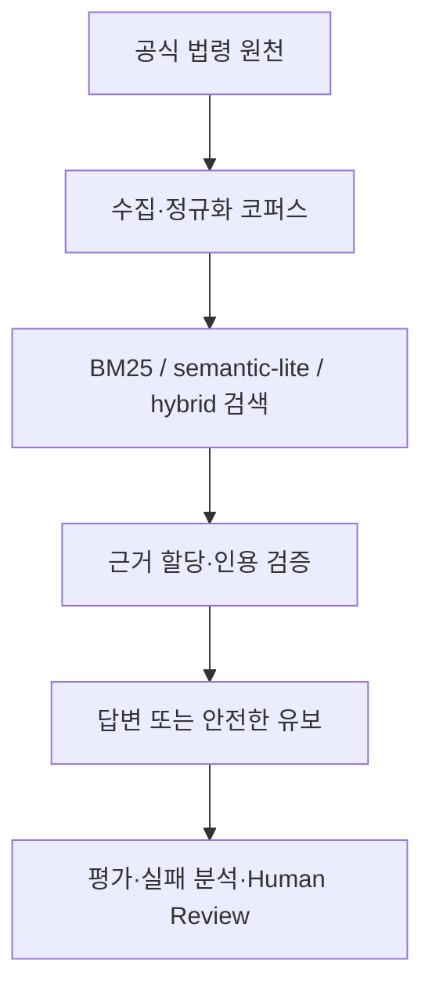

# 근거 기반 법률 RAG·Agent 평가

[](https://github.com/OrientingFreeman/law-rag-qa-planner/actions/workflows/ci.yml)


한국 법령의 조·항·호 구조와 시행 시점을 보존하고, 검색부터 근거 연결·인용 검증·안전한 답변 유보·실패 분석까지 추적하는 Legal RAG 프로젝트입니다.

단순한 법률 챗봇보다 **검증 가능하고 재현 가능한 전문 도메인 AI 시스템**을 만드는 데 초점을 둡니다. 법률 질문의 정답률을 과장하지 않고 검색, 답변 근거, 안전성 지표를 분리해 평가합니다.

[공개 데모](https://lawreasoning-demo.duckdns.org/) · [API 문서](https://lawreasoning-demo.duckdns.org/docs) · [v4.27.6 체크포인트](PROJECT_CHECKPOINT_V4276.md) · [상세 문서](#문서-안내)

> 공개 데모와 저장소의 최신 검증 체크포인트는 모두 `v4.27.6`입니다. 공개 응답은 UI에 필요한 필드만 제공하며 전체 추론 trace와 검수 기능은 관리자 인증 뒤에 분리합니다.

## 한눈에 보기

| 항목 | 현재 상태 |
| --- | --- |
| 최신 체크포인트 | `v4.27.6` |
| 법령 코퍼스 | 조·항·호 단위 문서 7,516개 |
| 공식 평가 데이터 | 61개 사례, dataset/schema/corpus 참조 검증 |
| 검색 | BM25, 문자 n-gram `semantic_lite`, hybrid 비교 |
| Agent Workflow | 10단계 실행 trace, 안전한 유보, 최대 1회 제한 재시도 |
| 데이터 품질 | 실패 유형화, human review, versioned dataset, checksum |
| Legal Reasoning | schema·참조 무결성 기반 구현, E2E 추론 엔진은 미구현 |
| 검증 | Python 3.10·3.12 CI, Docker smoke test, 324개 회귀 테스트 |

## 핵심 결과

### 검색 벤치마크

공식 61개 사례 중 gold 근거가 있는 비유보 문항 45개를 동일한 Top-K 5 조건에서 비교했습니다.

| Method | Top-1 | Hit@5 | MRR | nDCG@5 |
| --- | ---: | ---: | ---: | ---: |
| BM25 | 37.78% | 66.67% | 0.4689 | 0.5172 |
| semantic-lite | 46.67% | 73.33% | 0.5748 | 0.6148 |
| hybrid | 46.67% | 75.56% | 0.5730 | 0.6184 |

`semantic_lite`는 pretrained embedding이 아니라 의존성 없는 문자 n-gram 기준선입니다. 실제 embedding·reranker·fine-tuning 실험은 실행하지 않았으며, 미실행 모델의 성능 수치는 기록하지 않습니다.

### 워크플로 안전성 평가

61개 동일 사례를 deterministic provider와 hybrid 검색 조건으로 실행한 폐쇄형 평가입니다.

| Metric | Baseline | Agent Workflow |
| --- | ---: | ---: |
| 전체 통과율 | 59.02% | 68.85% |
| Top-1 | 44.44% | 44.44% |
| Hit@K | 71.11% | 71.11% |
| 보류 대상 정확도 | 56.25% | 93.75% |
| 전체 outcome 정확도 | 75.41% | 83.61% |
| 불필요한 보류율 | 17.78% | 20.00% |

개선은 검색 순위가 아니라 시점 불명·범위 과다·거짓 전제에 대한 안전 판정에서 발생했습니다. 12건의 재시도에서는 품질 개선이 관측되지 않아 성능 향상으로 주장하지 않습니다.

위 결과는 저장된 법령 코퍼스와 사전 정의된 정답을 사용하는 폐쇄형·결정론적 평가입니다. 외부 생성형 모델의 자유로운 법률 답변 정확도나 실제 법률 판단 정확도를 의미하지 않습니다.

### 법령 지식베이스 검증

법령 지식베이스는 49개 개념과 42문항의 폐쇄형 평가로 참조 무결성과 등록 어휘 연결을 검사합니다. 개인정보 보호법 제15조의 실제 개정 1건을 대상으로 시행일 경계 평가 2/2를 통과했고, 개정 검수의 9개 필수 항목과 통합 검증 역시 9개 단계를 통과했습니다. 이 결과는 등록된 개념과 단일 개정 사례의 검증이며 자유 질의 또는 일반적인 법률 판단 성능을 의미하지 않습니다.

## 설계의 핵심

- **법령 구조 보존**: 조·항·호, 시행일, 개정일과 공식 출처를 검색 단위에 유지합니다.
- **근거 우선 생성**: 검색된 근거만 답변 계약에 포함하고 미지원 인용을 탐지합니다.
- **안전한 유보**: 근거·시점·질문 범위가 불충분하면 확정 답변 대신 한계와 추가 확인 필요성을 반환합니다.
- **실패 주도 개선**: `retrieval_miss`, `wrong_top1`, `over_retrieval`, `incorrect_abstention`을 분리합니다.
- **검수 기반 데이터**: 자동 생성한 hard negative는 human review를 통과해야 학습 데이터로 export할 수 있습니다.
- **재현성**: dataset·corpus·split checksum과 검색기·prompt·provider 설정을 실험 결과에 기록합니다.

## 아키텍처



Agent Workflow는 질의 분석부터 품질 판정까지 각 단계의 상태, 소요시간, 검색 전략, 선택 근거 ID, 경고와 중단 사유를 `execution_trace`에 기록합니다.

## 구현 범위와 경계

| 영역 | 상태 |
| --- | --- |
| 법령 수집·정규화·시점 검색 | 구현 |
| 하이브리드 검색·근거 할당·인용 검증 | 구현 |
| Agent 실행 trace·안전한 유보·평가 | 구현 |
| 실패 기반 hard-negative 후보·human review | 구현 |
| Legal Reasoning Schema·참조 무결성 | 구현 |
| OCR provenance·품질 gate | private 자료에서 검증, 원문 비공개 |
| 실제 pretrained embedding·reranker·fine-tuning | 데이터 준비, 실행 보류 |
| 사실→요건 매칭·항변 분석·E2E Legal Reasoning MVP | 미구현 |

Legal Reasoning 영역은 Claim, Cause of Action, Element, Defense, Counter-defense, 주장·증명책임, 필요 사실, 증거 유형, 후속 질문과 법적 근거를 독립 노드로 표현합니다. 현재 구현은 schema와 무결성 기반이며, 자동 법률 결론 엔진이 아닙니다.

## 빠른 실행

### 로컬

```bash
git clone https://github.com/OrientingFreeman/law-rag-qa-planner.git
cd law-rag-qa-planner

python3 -m venv .venv
source .venv/bin/activate
pip install -r requirements.txt
cp .env.example .env

python -m law_rag.api
```

실행 후 다음 주소를 확인할 수 있습니다.

- 웹 UI: `http://127.0.0.1:8000/`
- OpenAPI 문서: `http://127.0.0.1:8000/docs`
- 상태 확인: `http://127.0.0.1:8000/health`

### Docker 실행

```bash
docker compose up --build
```

### API 예시

```bash
curl -X POST http://127.0.0.1:8000/answer \
  -H 'Content-Type: application/json' \
  -d '{
    "question": "개인정보 수집 동의 요건은 무엇인가요?",
    "domain": "digital_business",
    "top_k": 3
  }'
```

Agent trace를 포함한 실행:

```bash
curl -X POST http://127.0.0.1:8000/agent/runs \
  -H 'Content-Type: application/json' \
  -d '{
    "question": "개정 전 개인정보 수집 동의 요건은 무엇인가요?",
    "domain": "digital_business",
    "search_strategy": "hybrid",
    "max_retries": 1
  }'
```

## 평가와 재현

전체 회귀 테스트:

```bash
LAW_RAG_LLM_PROVIDER=deterministic python -m pytest -q
```

공식 평가 데이터 검증:

```bash
python tools/validate_evaluation_dataset.py
```

동일 조건 retrieval benchmark:

```bash
python -m tools.run_retrieval_benchmark \
  --methods bm25 semantic_lite hybrid \
  --top-k 5 \
  --fail-under-hit-at-k 0.60 \
  --fail-under-mrr 0.45
```

Baseline과 Agent 비교:

```bash
LAW_RAG_LLM_PROVIDER=deterministic python -m tools.run_rag_experiment \
  --mode baseline --dataset-version 2.0

LAW_RAG_LLM_PROVIDER=deterministic python -m tools.run_rag_experiment \
  --mode agent --dataset-version 2.0
```

GitHub Actions는 Python 3.10·3.12 전체 테스트, 결정론적 회귀평가, retrieval 기준선과 Docker API smoke test를 실행합니다.

## 대표 실패 유형

| 유형 | 의미 | 처리 방향 |
| --- | --- | --- |
| `retrieval_miss` | gold 근거가 Top-K에 없음 | query·corpus·동의어·검색기 점검 |
| `wrong_top1` | gold가 후보에는 있으나 1위가 아님 | hard negative·reranking 검토 |
| `over_retrieval` | 정답 외 후보까지 함께 반환 | 진단 플래그로 별도 기록 |
| `incorrect_abstention` | 답변/유보 기대와 실제 결과 불일치 | 안전 임계값과 질문 범위 점검 |
| unsupported citation | 검색되지 않은 조문 인용 | 최종 답변 계약에서 차단 |

## 프로젝트 구조

```text
law_rag/
├── api/           # FastAPI, 웹 데모, 요청·응답 schema
├── domain/        # 법령 및 도메인 모델
├── ingestion/     # 공식 법령 수집·정규화
├── retrieval/     # BM25·semantic-lite·hybrid 검색
├── generation/    # 답변 생성·근거 연결·인용 검증
├── reasoning/     # evidence/argument graph와 Legal Reasoning Schema
├── evaluation/    # 평가 데이터·실험·human review
└── workflow/      # Agent 단계와 execution trace

data/              # 공개 법령 코퍼스와 지식베이스
domains/           # 도메인별 설정
evaluation/        # 평가셋·검증된 baseline·fixture
tests/             # 단위·통합·회귀 테스트
tools/             # 데이터·평가·검수 CLI
```

## 문서 안내

| 문서 | 내용 |
| --- | --- |
| [현재 체크포인트](PROJECT_CHECKPOINT_V4276.md) | v4.27.6 구현·검증 범위와 명시적 한계 |
| [프로젝트 요약](docs/PROJECT_SUMMARY.md) | 문제, 기술적 기여, 평가와 활용 범위 |
| [최종 검증](docs/FINAL_VERIFICATION.md) | 최신 회귀 테스트와 API 검증 |
| [검색 벤치마크](docs/RETRIEVAL_BENCHMARK.md) | 검색기 비교 조건·수치·지연시간 |
| [Agent 워크플로](docs/AGENT_WORKFLOW.md) | 10단계 실행과 추적 계약 |
| [실험 비교](docs/EXPERIMENT_COMPARISON.md) | Baseline–Agent 비교와 trade-off |
| [평가 보고서](docs/EVALUATION_REPORT.md) | 지표 정의와 사례별 실패 분석 |
| [데이터 검수 가이드](docs/DATA_ANNOTATION_GUIDE.md) | gold·유보·검수 기준 |
| [Hard-negative 파이프라인](docs/HARD_NEGATIVE_PIPELINE.md) | 실패→후보→검수→내보내기 흐름 |
| [법률 추론 스키마](docs/LEGAL_REASONING_SCHEMA.md) | 스키마 범위와 E2E 미구현 경계 |
| [OCR 출처 감사](docs/OCR_PROVENANCE_AUDIT.md) | 비공개 OCR의 공개/비공개 경계 |

버전별 상세 변경사항은 [PATCH_NOTES.md](PATCH_NOTES.md)를 참고하세요.

## 공개·비공개 데이터 경계

공개 저장소에는 공개 법령·판례, 직접 작성한 최소 fixture, 범용 schema와 평가 코드만 포함합니다. 별도 보관 중인 저작권 OCR 원문, 페이지 snippet, source path, private review queue와 파생 지식베이스는 공개하지 않습니다.

비밀키는 환경변수로 주입하며 `.env`를 Git에 포함하지 않습니다. 공개 데모에서는 평가 실행과 검수 저장을 비활성화하고, 내부 평가·검수 화면과 관리 API를 HTTPS 관리자 인증으로 보호합니다. 공개 질의는 `top_k=5`로 제한하고 로그에는 질문 원문 대신 SHA-256 지문과 길이만 기록합니다.

## 다음 단계

1. 대여금 청구의 수동 기준 지식 구축
2. OCR→구조화 지식 후보 추출과 review/approval
3. 사건 사실→요건 매칭
4. 항변·부족 사실·후속 질문 처리
5. 판단과 법적 근거 연결 및 reasoning 정량평가
6. E2E Legal Reasoning MVP
7. 이후 retrieval 모델 실험과 민사 청구 확장

## 주의사항

이 프로젝트는 공개 법령을 이용한 비공식 기술 검증입니다. 실제 사건이나 조직의 의사결정에 적용하려면 최신 법령, 판례, 행정해석, 구체적 사실관계와 전문가 검토가 추가로 필요합니다.
